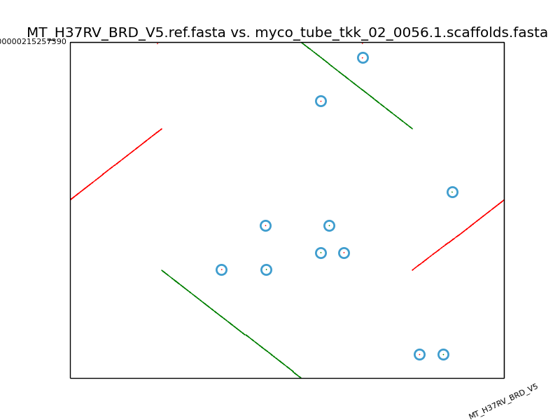

# ono
Order and orient

This tool tries to order and orient the contigs of a genome using a reference.
It is based on the libraries of : https://github.com/jasperlinthorst/reveal

	python assembly_finishing.py --minmum minimal_match_size -n number_of_N_to_insert_between_contigs reference.fasta contigs.fasta
optional :  
	-discard don't append the contigs that couldn't be ordered and orientated to the output.  
	-p prune all sequences of N to a single N (overrides the -n option), even those present in the input contigs.  
	-step is the maximal distance at which the tool will look for neighbourhing MUMs during the cleaning step. All mums that have another mum within step distance will be kept, other will be discarded. This is done in order to ignore isolated mums like the ones circled on the figure below that usually correspond to small duplication (transposable elements) when trying to order and orient contigs.  
	-smallest is similar to step, but is only used in the case that there is only one MUM on that contig. For example, a common transposable element in TB is IS6110 that is usually 1354bp long, meaning it can be the main element in a MUM with the default minmum size of 1000. This option is to discard contigs that have only 1 such MUM. (setting this value to a lower or equal value to minmum will not have any effect).

